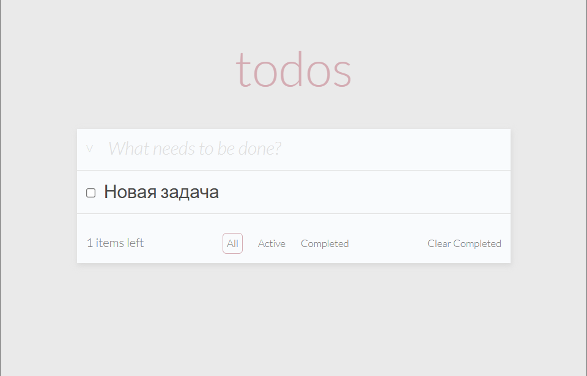

# 📝 ToDo App — Тестовое задание для Frontend Junior (Mindbox)

Простое, но функциональное приложение для управления списком дел, разработанное на React, TypeScript и React Hooks.



## 📦 Установка и использование

### 🔧 Установка зависимостей

```bash
npm i
```

### ▶️ Запуск в режиме разработки

Автоматическая перезагрузка при изменениях файлов:

```bash
npm run start
```

### 🏗 Сборка production-версии

Генерация статических файлов для деплоя:

```bash
npm run build
```

### 🚀 Деплой на GitHub Pages (опционально)

You may need `ssh-agent` configured:

```bash
npm run build
npm run deploy
```

### ✅ Запуск тестов

```bash
npm run test
```

---

## 🧪 Требования к заданию

### 🇷🇺 Задание

Создайте ToDo-приложение, позволяющее управлять текущим списком дел.

### Что должно быть в интерфейсе:

- Поле для ввода новой задачи
- Списки задач:
  - Все
  - Только невыполненные
  - Только выполненные

### Требования к коду:

- Использование **TypeScript**, **React**, **React Hooks**
- Можно использовать любую библиотеку компонентов
- Ключевая функциональность обязательно покрыта тестами
- Проект запускается командой: `npm i && npm run start`
- Доступен по ссылке (GitHub Pages / Vercel / и т.д.)

---

## 🌐 Демо-версия

> 👉👉 Ссылка на приложение: [https://mariaglukhovap.github.io/mindbox-test-task](https://mariaglukhovap.github.io/mindbox-test-task/)

---

## 📁 Использованные технологии

- React
- TypeScript
- React Hooks
- Vite
- CSS Modules
- Vitest + React Testing Library
